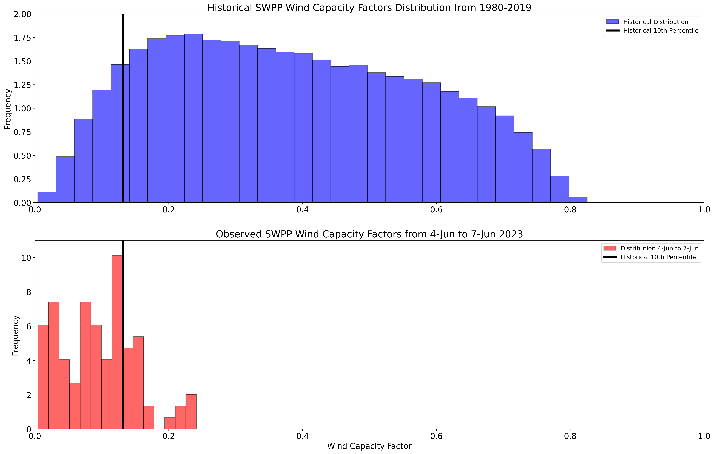

# spp_wind_forecast
This repository analyzes errors in the short- and medium-term wind and load forecast for the Southwest Power Pool (SPP) during the June 2023 wind lull event.

## Input Files
The input data needed to recreate this demonstration is stored in the [data](data/) directory.

## Summary Plots
Quick-look plots analyzing the data are stored in the [plots](plots/) directory.

## Key Results
* The medium-range forecasts of wind power are generally good out to 5 days and then diverge from observations. This is 
consistent with the general accuracy of weather forecasts.
* The load forecast is more accurate than the wind power forecast.

  

  

* Wind capacity factors during the lull period beginning on 3-June is historically low.
* Almost all the observed wind capacity factors from 4-June through 7-June fall below the 10th percentile of historical
values simulated from 1980-2019.

  

